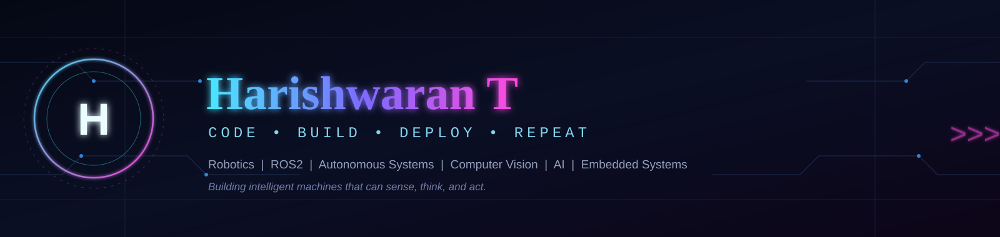

---

## 📖 About Me

I'm a Robotics & Automation Engineering student focused on building practical autonomous robotic systems.

- Working with ROS2 & autonomous navigation
- Exploring SLAM, Nav2, localization & path planning
- Building systems using Computer Vision & AI (YOLOv5/v8/v11, OpenCV)
- Hands-on experience with embedded systems & robotics hardware
- Comfortable with Python, C, and MATLAB fundamentals
- Currently a Robotics Intern deploying disinfection robots in live hospital field trials
- I enjoy turning robotics concepts into systems that actually work on hardware

**Current Focus:** ROS2 &nbsp;·&nbsp; Nav2 &nbsp;·&nbsp; SLAM &nbsp;·&nbsp; Computer Vision &nbsp;·&nbsp; AI &nbsp;·&nbsp; Embedded Robotics

---

## 🛠️ Tech Stack

<table>
<tr>
<td valign="top" width="25%">

**Robotics & Embedded**
  

</td>
<td valign="top" width="25%">

**Programming**
  

</td>
<td valign="top" width="25%">

**AI & Computer Vision**
  

</td>
<td valign="top" width="25%">

**CAD, Sim & Tools**
  

</td>
</tr>
</table>

---

## 🤖 What I Build

<table>
<tr>
<td width="33%" valign="top">

**Autonomous Robots**
 
ROS2-based mobile robots with SLAM, localization, and Nav2 path planning, deployed and tuned in real hospital field trials.

</td>
<td width="33%" valign="top">

**Computer Vision**
 
Real-time perception systems using YOLO, OpenCV, and MediaPipe for detection, pose tracking, and monitoring.

</td>
<td width="33%" valign="top">

**Intelligent Systems**
 
Fault-tolerant, AI-assisted pipelines for monitoring, detection, and automation — from surveillance to patient safety.

</td>
</tr>
</table>

---

## 🚀 Featured Projects

- **[MediSense](https://github.com/Harishwaran25)** — Contactless patient safety monitoring system: fall, agitation, unconsciousness, and posture-change detection across 6 modules using MediaPipe pose tracking + YOLO. Rolling-window smoothing and a 3-stage confirmation state machine cut false alarms by 27%; non-blocking Hugging Face emotion-detection thread with zero added latency; refactored into a production-style package with a pytest suite.
  `Python` `OpenCV` `YOLO` `MediaPipe` `Hugging Face` `pytest`

- **UVDS Autonomous Navigation Robot** *(Spotless AI Robotics)* — Deployed a ROS2 AI-powered autonomous robot for non-touch UV-C hospital disinfection. Configured and tuned a SLAM Toolbox mapping/localization pipeline, validated navigation ahead of live runs in RViz, and diagnosed mapping drift and Nav2-stack issues during real-world commissioning across 4 hospital sites.
  `ROS2` `SLAM Toolbox` `Nav2` `RViz` `Linux`

- **[Swarm Robotics using ROS2](https://github.com/Harishwaran25)** — 2-robot swarm system focused on inter-robot communication, coordination, and scalability; ROS2 nodes/topics/services for distributed control, formation control, task allocation, and cooperative navigation — ~90% successful task completion in simulation.
  `ROS2` `Python`

- **Crime Detection using YOLO** *(Real-time Surveillance)* — Python-based AI surveillance system for real-time detection of weapons, suspicious objects, and unusual activity using YOLOv5 + OpenCV + TensorFlow on a custom-labelled dataset; lightweight edge-inference version deployed on Raspberry Pi, 90%+ accuracy in controlled tests.
  `Python` `YOLOv5` `OpenCV` `TensorFlow` `Raspberry Pi`

- **Multipurpose Agri-Bot** — Modular autonomous agricultural robot (Fusion 360) for ploughing, irrigation, and spraying, with IoT-based remote controls and an Arduino control system; reduced manual labour by 60% in prototype field testing.
  `Fusion 360` `Arduino` `IoT`

---

## 💼 Work Experience

- **Robotics Intern — Spotless AI Robotics** *(Jan 2026 – Present)*: Deployed and validated ROS2 UV disinfection robots across 4 sites; tuned SLAM Toolbox mapping/localization (−15% drift); resolved recurring Nav2 planner failures across 6+ field trials (+20% routing reliability); validated full-coverage disinfection routing across ~2,000 sq. ft/session.
- **IoT Intern — Apex I Sys** *(Jun 2025)*: Built a real-time Raspberry Pi surveillance system (~85% detection accuracy, sub-5s alerting) with Python event-detection logic across 2 notification channels.
- **CAD Designer — Karthikesh Robotics Pvt Ltd** *(Jan–Feb 2025)*: Designed and modelled 10+ mechanical components/assemblies in Fusion 360 and SolidWorks; reduced material usage by ~12% and cut prototype iteration time by 2 days/cycle across 3 projects.

---

## 📊 GitHub Statistics

  
  

  

  

### 🐍 Contribution Snake

  

> ⚠️ The snake animation needs a one-time GitHub Action set up in your profile repo — see `snake.yml` (shared alongside this file) for the workflow that generates it automatically. Until that workflow runs once, this image will show broken.

---

## 🎓 Education

**B.E. Robotics and Automation** — Sri Ramakrishna Engineering College (2023–2027)
CGPA: 8.79 / 10

---

## 📜 Certifications

- Control System Basics — e-Yantra, IIT Bombay
- MicroROS Basics — e-Yantra, IIT Bombay
- Artificial Intelligence with Python — E-Cell, IIT Madras

---

### 🌐 Connect With Me

*"Building intelligent machines that can sense, think, and act."*

